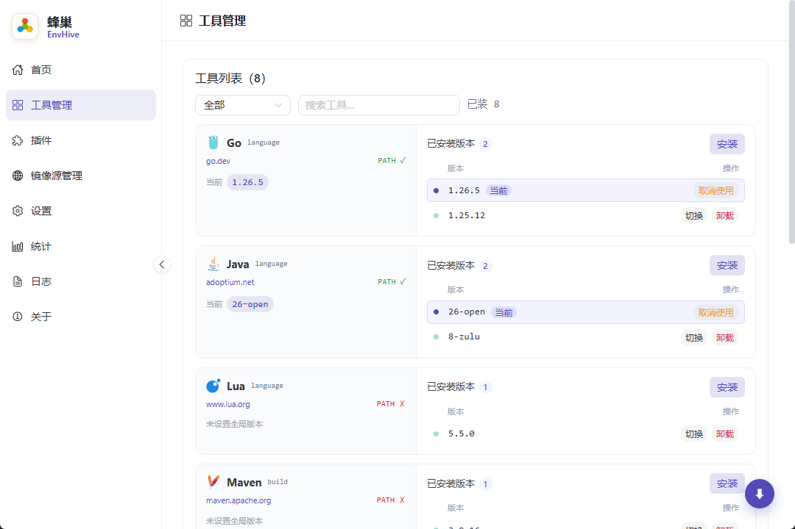
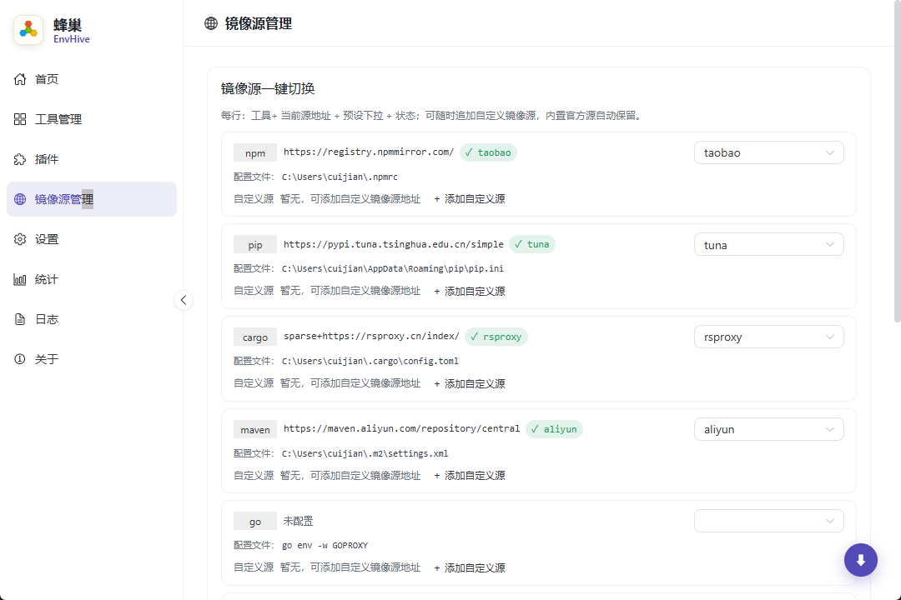
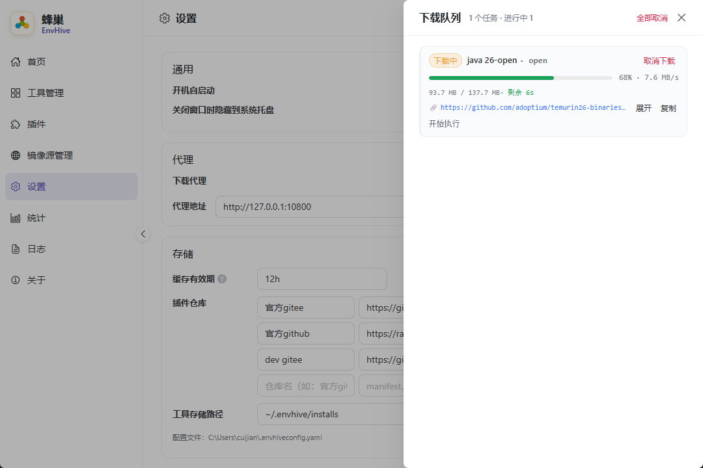
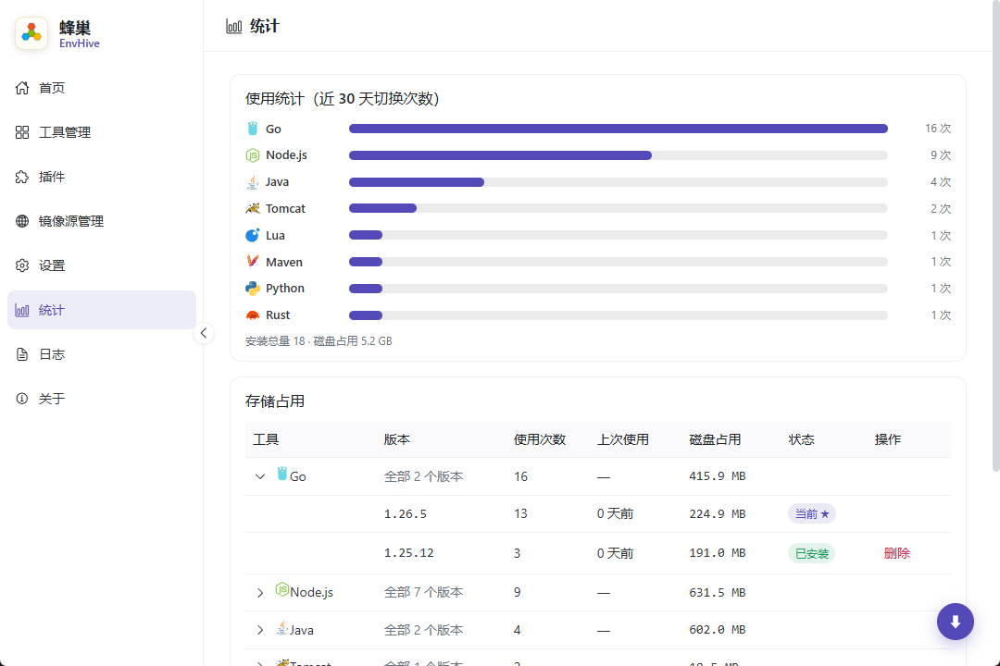

# 蜂巢 EnvHive

> 多语言运行时 · 环境配置中枢

EnvHive（蜂巢）是一款跨平台桌面应用，用于**安装与管理 Java / Node.js / Go / Rust / Python / Lua / Maven / Tomcat 等语言运行时**，支持多版本切换、环境变量注入、镜像源一键切换与项目级环境配置。


---

## 功能特性

### 🛠 工具管理（全部插件化）
- **真实安装 / 卸载与版本切换**：对接各语言官方下载源（Adoptium、nodejs.org、go.dev 等），安装包做 SHA-256 校验与签名级校验；
- **「发行商 × 版本」两级维度**：同一工具可区分发行商，如 Java 内置 8 家发行商（OpenJDK、Temurin、Bisheng、Corretto、GraalVM、Zulu、Dragonwell、Liberica），JavaFX 构建直接体现在版本标识符上（SDKMAN 风格，如 `26.0.2.fx-open`）；
- **批量下载队列**：多工具并行安装、冲突检测、统一进度管理（实时速率 / 剩余时间 / 镜像回退提示）。

### 🌐 环境配置一键切换
- **环境变量注入**：PATH / JAVA_HOME / GOROOT 等随工具自动写入；Windows 下通过注册表 `REG_EXPAND_SZ` + `WM_SETTINGCHANGE` 广播，新终端即生效；
- **镜像源一键切换**：npm / cargo / maven / go / docker / nuget / gem / pub / conda 等内置官方源与预设镜像，支持自定义镜像源追加；
- **代理应用内生效**：下载代理 / 工具代理 / 插件请求共用同一代理配置，**不修改系统全局代理**。

### 📦 项目级环境（`.envhive.toml`）
- **三作用域配置链**：`Global`（`~/.envhive/.envhive.toml`）< `Session` < `Project`（从工作目录向上自动定位 `<project>/.envhive.toml`），后者优先；
- **CLI 双二进制**：`envhive-cli init` 生成项目配置、`envhive-cli load` 输出各 shell（bash / zsh / fish / powershell / cmd）可 eval 的环境注入脚本，实现**终端内一键进入项目环境**；
- 项目环境按预设版本组合启动会话，不污染系统变量。

### 🔌 Lua 插件生态
- **零内置硬编码**：所有运行时（含官方语言）均由 Lua 插件描述，插件从 Git 仓库（默认 Gitee、备用 GitHub）`manifest.json` 市场同步，应用启动时后台自动补齐缺失插件，也可在「插件市场」手动安装 / 更新；
- **完整生命周期 hook**：`available(ctx)` / `pre_install(ctx)` / `post_install(ctx)` / `env_keys(ctx)` / `pre_uninstall(ctx)`；
- **内置模块**：`http.get`（NETWORK_ALLOW 白名单）、`json`、`archiver.extract`、`file`、`versions.parse`（SDKMAN 标识符解析），插件 `lib/` 子目录可 require 私有模块；
- **单文件工具安装**：`pre_install` 返回非归档 URL 时按单文件直接放置、自动补执行权限，`extra_files` 附带同目录依赖（如 Windows dll）；
- ⚠️ 可信插件模型：插件可执行命令 / 读写文件（放开 Lua 标准库），**请仅从可信来源安装插件**。

### 🖥 桌面端能力
- 托盘图标常驻、单实例运行、内置自动更新（Tauri updater）、使用统计、日志查看、开机自启等。

---

## 界面预览

<table>
  <tr>
    <td width="50%"><br /><b>工具管理</b>：工具列表 + 发行商 + 已安装版本，切换 / 卸载 / 安装一目了然。</td>
    <td width="50%"><br /><b>镜像源管理</b>：每行展示当前源地址、预设下拉、配置文件路径，支持自定义源追加。</td>
  </tr>
  <tr>
    <td width="50%"><br /><b>下载队列</b>：实时进度条、下载速率、剩余时间与镜像回退提示，关闭页面后下载照常进行。</td>
    <td width="50%"><br /><b>使用统计</b>：近 30 天切换次数柱状图 + 存储占用表，一键定位大文件、清理冷门版本。</td>
  </tr>
</table>

---

## 快速开始

### 前置条件

| 依赖 | 说明 |
|---|---|
| [Node.js](https://nodejs.org) ≥ 18 | 前端构建 |
| [Rust](https://rustup.rs) stable（含 cargo） | Tauri 后端 |
| Windows | Visual Studio Build Tools（MSVC C++ 编译链，`winget install Microsoft.VisualStudio.2022.BuildTools` 或勾选「使用 C++ 的桌面开发」） |

### 启动开发环境

```bash
cd app
npm install          # 安装前端依赖
npm run tauri dev    # 启动桌面应用（自动拉起 vite + cargo）
```

仅预览前端界面（不启动桌面窗口）：

```bash
npm run dev          # 浏览器访问 http://localhost:1420
```

### 打包发布

```bash
npm run tauri build  # 产出安装包：app/src-tauri/target/release/bundle/
```

---

## 使用指南

| 页面 | 功能 |
|---|---|
| **首页（总览）** | 全局环境 / 项目环境总览、环境变量与 PATH 条目统计、折叠式环境变量总览 |
| **工具管理** | 工具安装 / 卸载 / 版本切换、发行商选择、批量下载队列、解除环境变量 |
| **插件** | 浏览 / 安装 / 更新 Lua 插件（默认官方 Gitee 仓库，可切换 GitHub / 其它自定义仓库） |
| **镜像源管理** | 镜像源一键切换（内置官方源自动保留）、自定义镜像源、代理配置 |
| **设置** | 应用偏好（数据目录、开机自启、代理、缓存有效期、插件仓库列表等） |
| **统计** | 工具使用情况统计 |
| **日志** | 实时查看运行日志，便于排查问题 |
| **关于** | 版本信息与自动更新 |

### 项目级环境示例

```toml
# <project>/.envhive.toml
[tools]
nodejs = "22.11.0"
java = { version = "21", vendor = "tem" }

[env]
MY_PROJECT_FLAG = "1"
```

```bash
envhive-cli init --tool nodejs=22.11.0   # 生成项目配置
eval "$(envhive-cli load)"               # bash/zsh 注入项目环境
```

---

## 技术架构

```
┌───────────────────────────── 前端（Vue 3 + Naive UI）─────────────────────────────┐
│  HomePage · ToolsPage · PluginsPage · NetworkPage · SettingsPage · StatsPage · LogsPage · AboutPage │
└───────────────┬───────────────────────────────────────────────────────────────────┘
                │ Tauri invoke / event
┌───────────────▼───────────────────────────────────────────────────────────────────┐
│  envhive-manager     工具 / 插件 / 镜像 / 环境编排、下载队列、统计、项目、自启      │
│  envhive-toolkit     Lua 插件 VM(mlua)、镜像源、下载校验、Shell 渲染、注册表        │
│  envhive-core        配置链(Global/Project/Session)、环境合并、Windows 注册表      │
│  envhive-cli         init / load —— 项目配置生成与终端环境注入（无 Tauri 依赖）    │
└────────────────────────────────────────────────────────────────────────────────────┘
```

| 层 | 选型 |
|---|---|
| 桌面框架 | [Tauri 2](https://tauri.app)（Rust 后端，安装包 ~10MB） |
| 前端 | Vue 3 + TypeScript + [Vite](https://vitejs.dev) + [Naive UI](https://www.naiveui.com) |
| 后端 | Rust workspace 多 crate（core / toolkit / manager / cli），工具驱动全部由 Lua 插件完成（mlua VM） |
| 数据根目录 | `~/.envhive`（配置、已安装工具、插件、临时会话） |

---

## 目录结构

```
envhive/
├── app/                            # 桌面应用
│   ├── src/                        # 前端源码（Vue 3 + TS）
│   │   ├── pages/                  #   首页 / 工具管理 / 插件 / 镜像源管理 / 设置 / 统计 / 日志 / 关于
│   │   ├── components/             #   工具卡片、环境表格、队列抽屉、版本选择器等
│   │   ├── hooks/useBackend.ts     #   invoke 封装 + Tauri 事件订阅
│   │   ├── store.ts                #   全局状态
│   │   └── updater.ts              #   自动更新
│   ├── src-tauri/                  # Rust 后端
│   │   ├── crates/
│   │   │   ├── envhive-core/       #   配置链、环境合并、错误、事件、日志、Windows 注册表
│   │   │   ├── envhive-toolkit/    #   Lua 插件 VM、镜像源、工具下载/校验/安装、Shell 渲染
│   │   │   ├── envhive-manager/    #   业务编排、下载队列、统计、项目、开机自启
│   │   │   └── envhive-cli/        #   终端 CLI（init / load）
│   │   ├── src/commands/           #   Tauri 命令（tool / registry / plugin / project …）
│   │   ├── capabilities/           #   权限声明
│   │   └── tauri.conf.json         #   窗口 / 打包 / 更新配置
│   ├── scripts/gen_icons.py        # 纯 stdlib 生成蜂巢图标（PNG/ICO）
│   └── vite.config.ts              # Vite 配置（端口 1420）
├── plugins/                        # 插件仓库（官方）
│   ├── src/<name>/                 #   Lua 插件源码（plugin.lua + icon.svg + lib/）
│   ├── zip/<name>.zip              #   构建产物
│   ├── manifest.json               #   插件市场清单（schema v2）
│   └── build_plugins.py            #   插件仓库构建脚本
├── docs/                           # 设计文档
└── LICENSE
```

---

## 插件仓库构建

```bash
python plugins/build_plugins.py            # 全量构建：扫描 plugins/src/ → 打 zip → 更新 manifest
python plugins/build_plugins.py --verify   # 仅校验 zip 与 manifest 一致性
```

---

## 相关文档

- 里程碑与完整功能清单见 `app/README.md` 中的「当前进度」

---

## 许可证

[木兰宽松许可证，第 2 版（Mulan PSL v2）](LICENSE) · [官方文本](http://license.coscl.org.cn/MulanPSL2)
